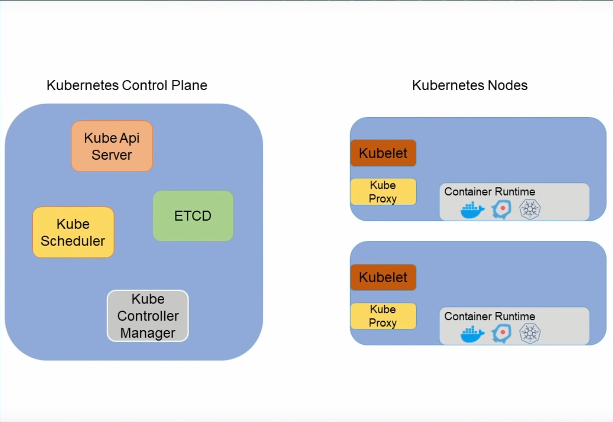
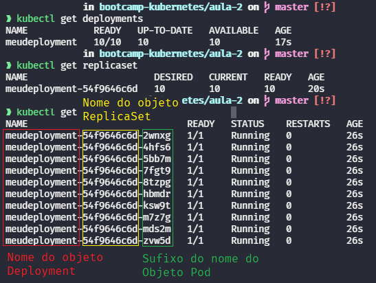

# Bootcamp Kubernetes - Aula 2

Demonstrar conhecimento através de postagens e também do github.

## Arquitetura do Kubernetes

O kubernetes é formado por um cluster, um conjunto de máquinas, tendo um dos seguintes papéis:
- `Control Plane`: Gerencia os nodes e orquestra todo cluster.
  - `Kube Api Server`: Recebe toda a comunicação com o Cluster. Quando executo um comando com `kubectl`, é com ele que eu estou me comunicando.
  - `ETCD`: É um banco chave-valor que armazena dados do Kubernetes. Mas nós nunca acessamos seus dados diretamente pelo `ETCD`, pegamos esses dados nos comunicando com o `Kube Api Server`.
  - `Kube Scheduler`: Organiza onde cada processo será executado. Analisa as especificações e define em qual node o processo será executado.
  - `Kube Controller Manager`: Executa e gerencia todos os controladores do Kubernetes. Administra as tomadas de decisões do Kubernetes, como autenticações, autorizações, ou admissões.
- `Node`: Executa os containers das aplicações.
  - `Kubelet`: Agente de inspeção e execução dos containers no node. Monitora e executa os container, e também interage com o `Kube Api Service`.
  - `Kube Proxy`: Responsável pelas comunicações de rede com o cluster.
  - `Container Runtime Interface (ou CRI)`: Especificações necessárias para o container runtime seja utilizado dentro do Kubernetes para executar os containers (como `Docker`, `ContainerD`, `Cri-o`, entre outros).



---

## Criação de um Kubernetes Local

### Instalação dos recursos necessários

Utilizaremos o `k3d`, que basicamente roda os clusters em containers.

Para instalar o `k3d` é só acessarmos seu [site](https://k3d.io/#installation) e seguir o guia de instalação.

Também precisaremos fazer a instalação do Kubernetes, onde podemos encontrar suas instruções [aqui](https://kubernetes.io/docs/tasks/tools/).

Por padrão, o arquivo de configuração ficará na sua pasta pessoal, dentro de uma pasta chamada `.kube`. Utilizando o linux como, ficaria no seguinte path: `~/.kube/config`.

### Criação do cluster

Para criarmos nosso cluster, basta utilizar o comando:
```sh
$ k3d cluster create ${CLUSTER_NAME} --no-lb --servers 3 --agents 3
```
- `--no-lb`: Podemos evitar a criação do [loadbalancer](#k3d_loadbalancer).
- `--server ${NUMBER_SERVERS}`: Cria o cluster com **`${NUMBER_SERVERS}`** servers.
- `--agents ${NUMBER_AGENTS}`: Cria o cluster com **`${NUMBER_AGENTS}`** agents.

Por padrão, será criado um único node para o nosso cluster. Para verificar os nodes podemos utilizar o comando:
```sh
$ kubectl get nodes
```

E para verificarmos os containers em que nosso cluster está rodando basta listar com o docker: 
```sh
$ docker ps -a
```
Podemos ver que existem dois containers, um se tratando do node, e outro, com o sufixo `servelb`. Esse segundo é um loadbalancer, para ser mais fidelistico à cenários reais, o `k3d` cria um 
<a name="k3d_loadbalancer">loadbalancer</a> para lidar com as requisições, e às divide entre os nossos nodes.

Vamos criar um novo cluster, sem o loadbalancer:
```sh
$ k3d create cluster ${CLUSTER_NAME} --no-lb
```

Listando os containers Docker, podemos ver que agora o loadbalancer não foi criado.

Podemos, também, listar nossos clusteres criados pelo `k3d`:
```sh
$ k3d cluster list
```

Para deletermos nossos clusters:
```sh
$ k3d cluster delete ${CLUSTER_NAME}
```

---

## Elementos de um deploy no Kubernetes

- [Pod](#pod_creation): Menor objeto do cluster Kubernetes. Nele são executado os containers. Pode ser executado mais de um container num mesmo pod, dividindo o mesmo IP do pod, e também podem dividir o mesmo sistema de arquivos.
- [Replicaset](#replicaset): Mantém o número de objetos iguais aos definidos. Podemos espeficiar que um objeto terá 5 replicas, e caso algum objeto caia, ou seja criado um novo, o replicaset fará com que o número de réplicas se mantenha em 5, seja excluido uma execução mais antiga, ou criando uma nova.<br>
**Nem sempre é possível manter o número de réplicas conforme o definido, seja por falta de recursos, ou alguma regra que impede a criação desse pod**
- [Deployment](#deployment): Assim como o replicaset cria os pods, o deployment cria nossos replicasets. Ele garante que ao atualizar um replicaset, nossos pods serão recraidos, atualizando assim nossos serviços. Uma característica muito interessante, é que ao invés de deletar um replicaset antigo, ele apenas o inativa. Isso se deve para fácil troca de versões, ou seja, caso você tenha feito um deploy de uma nova versão do seu serviço e, por algum motivo houve um problema nessa nova versão, você pode voltar à versão anterior do replicaset, voltando assim, à versão anterior dos pods e por fim, tendo seu serviço, online, na versão anterior.<br>
***Note que a versão anterior não significa os pods anteriores, então, novos pods serão criados, mas na versão anterior***

### <a name="pod_creation">Criação de um pod</a>
Parar criar um pod, criaremos um arquivo `.yaml` que é um manifesto especificando a criação do nosso pod para o Kubernetes.

```yaml
# Agrupamento de API que utilizaremos no Kubernetes, serve para separarmos e agruparmos objetos.
# Podemos separar, por exemplo, objetos que estão em beta, dos que estão em alfa, ou em release.
apiVersion: v1
# Tipo de objeto que vamos criar
kind: Pod
metadata:
  name: meupod
  # Podemos colocar labels em nosso pod, para utilizar seletores e podermos pegar nossos objetos através de alguma referência
  labels:
    app: nginx 
# Especificação desse objeto, no caso do Pod, especificaremos os containers que irão ser executados
spec:
  containers:
    - name: site
      image: kubedevio/nginx-color:blue
      ports:
        - containerPort: 80

```
Podemos listar todos os recursos que temos, para utilizar no `apiVersion`:
```sh
$ kubectl api-resources
```
Preencheremos o `kind` com o tipo de objeto que criaremos, a informação também aparece no comando anterior, na coluna `KIND`.

Para criamos nosso objeto no cluster:
```sh
$ kubectl create -f ${MANIFEST_PATH}
```

Podemos ver nossos pods com:
```sh
$ kubectl get pods -l ${POD_LABEL_TAG}:${POD_LABEL_VALUE} -o ${OUTPUT_FORMAT}
```
  - `-l ${POD_LABEL_TAG}:${POD_LABEL_VALUE}}`: Podemos filtrar nossos pods através de labels, sendo assim, especificando a tag e o valor da label, podemos mostrar apenas um grupo de objetos que temos interesse.
  - `-o ${OUTPUT_FORMAT}`: Podemos especificar a forma como nosso output será, dentre algumas opções. Entre elas `json|wide|yaml|name|...`.

E também podemos descreve-los com:
```sh
$ kubectl describe pod ${POD_NAME}
```

Para acessarmos nosso pod, precisaremos fazer um port bind:
```sh
$ kubectl port-forward ${POD_NAME} ${OUT_PORT}:${INNER_PORT}
```

E para deletarmos nosso pod:
```sh
$ kubectl delete pod ${POD_NAME}
```

***Essa forma de criação de um pod é apenas para fins didáticos, pois ela não tem escalabilidade e nem resiliência. Se excluirmos um pod criado dessa forma, ele não é recraido.***

### <a name="replicaset">Gerenciando os pods com Replicaset</a>

Criaremos um objeto `ReplicaSet` com o seguinte script:
```yaml
apiVersion: apps/v1
kind: ReplicaSet
metadata:
  name: meureplicaset
spec:
  selector:
    matchLabels:
      app: nginx
  # Igual o manifesto do nosso pod, com a diferença de que o nome não é especificado, já que várias réplicas serão criadas
  # o nome é criado, também, em tempo de execução
  template:
    metadata:
      labels:
        app: nginx
    spec:
      containers:
        - name: site
          image: kubedevio/nginx-color:blue
          ports:
            - containerPort: 80

```

Podemos utilizar o comando `apply` tanto para criar ou atualizar um objeto:
```sh
$ kubectl apply -f ${MANIFEST_PATH}
```

Podemos, também, escalar nossas replicas em linha de comando:
```sh
$ kubectl scale replicaset ${REPLICASET_NAME} --replicas ${NUM_REPLICAS}
```
***Agora temos escalabilidade e resiliencia de nossos pods :)***


### <a name="deployment">Gerenciando os replicasets com o Deployment</a>

Nosso objeto deployment criará automaticamente nossos replicasets, que por sua vez, criarão nossos pods. Nosso manifesto do Deployment é quase o mesmo do ReplicaSet, mudando apenas seu tipo (`kind`).
```yaml
# A estrutura do Deployment é exatamente a mesma do ReplicaSet

apiVersion: apps/v1
kind: Deployment
metadata:
  name: meudeployment
spec:
  replicas: 10
  selector:
    matchLabels:
      app: nginx
  template:
    metadata:
      labels:
        app: nginx
    spec:
      containers:
        - name: site
          image: kubedevio/nginx-color:green
          ports:
            - containerPort: 80

```

Podemos observar que agora, o nome de nossos pods possuí uma estrutura montada da seguinte forma:


Podemos dar um rollback no nosso deployment, da seguinte forma:
```sh
$ kubectl rollout undo deployment ${DEPLOYMENT_NAME}
```

---

## Service discovery

Com nossos pods rodando de forma onde podemos fazer um deploy com zero down time, agora precisaremos fazer com que nossos pods sejam acessiveis.

Temos vários tipos de services, sendo algum deles:
- `Cluster IP`: Utilizado para expor um pod de maneira interna, como por exemplo, tendo um pod A e B podemos permitir que o pod A acesse o pod B. Um exemplo mais realistico seria uma api  (pod A) acessar um banco de dados (pod B).
- `Node Port`: Pode ser acessado de forma externa (do Kubernetes), mas ele tem uma característica onde, você poderá acessar pelo ip de qualquer máquina do seu cluster Kubernetes. A porta reservada é eleita automaticamente, mas fica no intervalo [30 000, 32 767] (por padrão).
- `Loadbalancer`: Trabalha integrado com seu serviço de nuvem, assim, um IP é solicitado para seu serviço de nuvem, e esse IP é configurado para ser seu acesso ao service.

### Criando nosso service para acesso aos pods

Também criaremos um manifesto para criação do nosso service:

```yaml
apiVersion: v1
kind: Service
metadata:
  name: nginx-service
spec:
  selector:
    app: nginx
  ports:
    - port: 80
      # Podemos especificar a porta que será elegida
      nodePort: 30000
  type: NodePort
```

Aplicamos o objeto e em seguida podemos lista-lo:

```sh
$ kubectl apply -f ${MANIFEST_PATH}

$ kubectl get services
```

Agora, já que nosso cluster está rodando dentro de um container Docker, precisaremos fazer um bind de porta entre nossa porta externa e a porta interna que o Kubectl reservou para acessar nossos pods. Para fazer isso, deletaremos nosso cluster antigo e criaremos um novo passando nossa porta que será bindada.

```sh
$ k3d create cluster --agents 3 --servers 3 -p "${OUT_PORT}:${INNER_PORT}@loadbalancer"
```
- No caso do yaml mostrado acima, o valor de ${INNER_PORT} será 30000