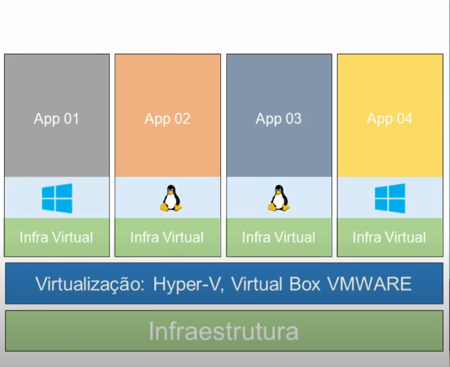
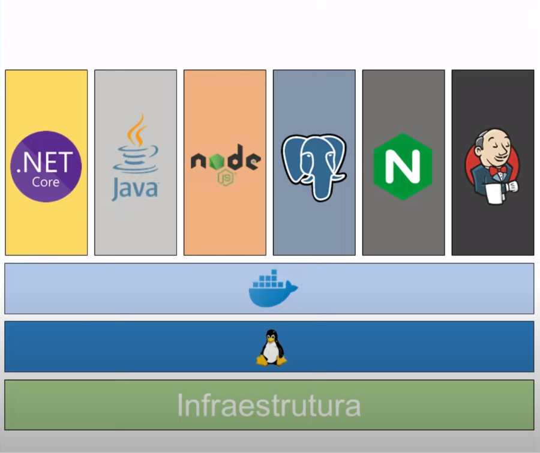
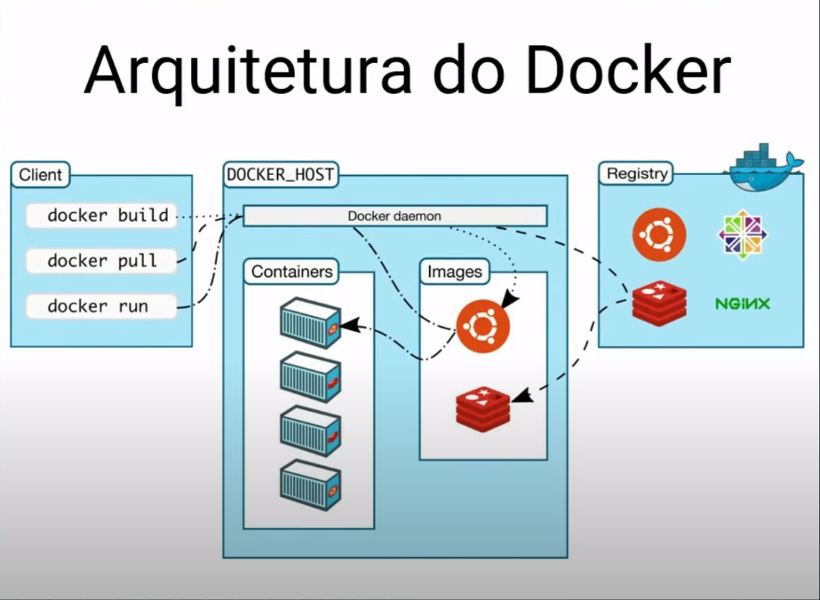
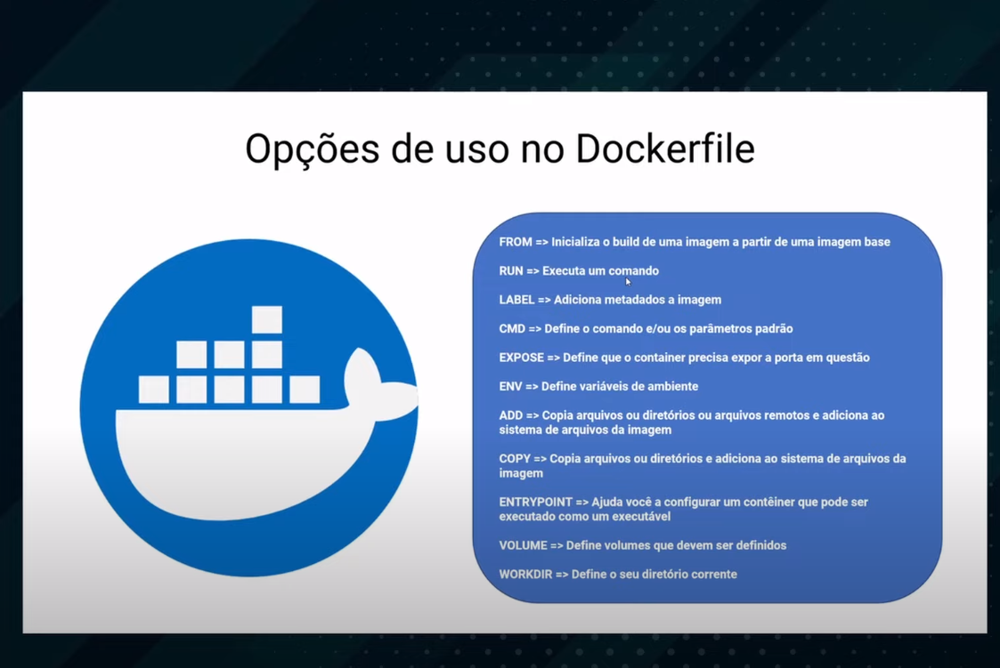

# Bootcamp Kubernetes

Algumas informações core, interessantes de se saber

## Virtualização vs Containerização

A virtualização tem como base a infraestrutura, logo acima, uma camada de virtualização, e por fim, minha infra virtual.<br>
O problema da virtualização, é que pra cada máquina, precisamos instalar e gerenciar um OS, além de alocar recursos, como por exemplo, 1 GB de RAM e uma CPU, para cada app...



<br>

Enquanto isso, na containerização, temos a camada de infraestrutura, depois o sistema operacional, depois nosso container runtime (docker, por exemplo), que executa e gerencia nossos containers, executando nossos processos (aplicações nodejs, .net, postgres, etc).

**_Como pode ver, não temos mais uma penca de sistemas operacionais, nem alocação manual de recursos para cada um. Nosso container runtime, simula um SO para rodar nossas aplicações_**



 <br>

---

## Imagens e containers, qual a diferença?

Nossas imagens são templates, como blueprints de um prédio, e baseado na blueprint, podemos construir nosso prédio, que, nessa analogia, seria equivalente ao container. Portanto, as imagens são como as classes, na POO, equanto os containers são como os objetos => As imagens são o template, e o container é a própria instância.
<br>

---

## Arquitetura do Docker

A arquitetura do docker é formada por três componentes

- Docker deamon
- Docker Client
- Docker Registry



### <a name="docker_deamon"></a>Docker deamon

Componente que gerencia os objetos do docker, como as imagens, containers, networks e os volumes. Todo o processo de execução dos containers acontece aqui.

### <a name="docker_client"></a>Docker client

Para se comunicar com o [Docker deamon](#docker_deamon), temos o [Docker deamon](#docker_client), onde através de comandos, podemos enviar instruções para o [Docker deamon](#docker_deamon).

- **_Nem sempre o docker deamon e o docker client estão na mesma máquina_**

### <a name="docker_registry"></a>Docker registry

Fazendo um paralelo com um repositório git, é aqui onde guardamos nossas imagens.

---

## Alguns comandos

***Observação importante: os parâmetros que passamos (como `--name` ou `-i`) devem ser colocados antes do nome da imagem.** *

- (`docker container run` || `docker run`) `--name meu-container-hello-world hello-world`:
  - Executamos um container com base na imagem `hello-world`, que caso não exista na sua máquina, irá ser baixada automaticamente do registry do Docker.
  - `--name $name`: especifica um nome (`$name`) para o container.
  - `-i`: declarar utilização do modo interativo.
  - `-t`: tty, para ter acesso ao console.
  - `-d`: modo detach, para iniciar o container com terminal liberado.
  - `-p $port_out:$port_in`: Faz um bind da porta `$port_out` para a porta `$port_in`.
  - `... $image /bin/bash`: posso passar, no final do comando, `/bin/bash` para abrir o container com o terminal, ao invés de abrir o processo que ele executa por padrão.
- `docker container ls -a` ou `docker ps -a`:
  - Lista nossos containeres em execução. Com a flag `-a`, mostra todos os containers.
- `docker container rm` ou `docker rm` (`9874cbab84e` ou `meu-container-hello-world`):
  - Especifica um container pelo id ou nome, e o deleta.
  - Um truque para deletar todos os seus container é utilizar o comando `docker rm $(docker ps -aq)`.
- `docker image history`: mostra as estapas de criação de uma imagem.
- `docker image prune`: remove as imagens sem nome.

---

## Criando imagens

Parar criarmos nossa imagem, precisaremos de uma imagem como base. Nosso é criar uma imagem ubuntu com o curl, então, utilizaremos a imagem do `ubuntu` como base. <br>
Depois, atualizaremos nossos repositórios com `apt-get update` e por fim instalaremos o curl com `apt-get install curl -y` (o `-y` serve para aceitar as licensas automaticamente, não interrompendo o processo de instalação).

```Dockerfile
# Determino a imagem que servirá como base para a imagem que irei criar
# É uma boa prática especificar a versao da imagem que utilizaremos
FROM ubuntu:21.04

# Roda o comando instruido
# É uma boa prática instalar os pacotes junto com o apt-get update, para evitarmos cachear o apt-get update, que pode levar à erros como baixar um pacote desatualizado.
RUN apt-get update -y && \
  apt-get install curl -y
```
<br>
Para buildar nossa imagem, utilizaremos o comando a seguir, onde `$image_name` será o nome da imagem e `$path_dir` o path de onde nosso Dockerfile está.

```sh
$ docker image build -t $image_name $image_dir
```

Considerando nosso exemplo atual, ficará assim:

```sh
$ docker image build -t ubuntu-curl .
```

Com isso, o `$path_dir` é o path que será enviado para o [docker deamon](#docker_deamon), que irá ler nosso Dockerfile e construirá nossa imagem.
<br><br>
***Algo interessante de se destacar, é que na hora de criar nossa imagem, o docker cacheia os comandos sequencialmente, então na próxima vez que você buildar uma imagem, ele irá utilizar o cache até a linha em que houve a alteração. Isso significa que podemos construir imagens otimizadas, diminuindo a etapa de build.***

## Enviando imagem para o registry [Docker Hub](https://hub.docker.com/)

Autenticamos com `docker login`, e informando nosso `username` e `senha` logo em sequência.
<br>

Antes de enviarmos nossa imagem, precisamos renomea-la, pois existe um padrão de nome para imagens no Hub.
O padrão é este:
`$namespace/$repository:$tag`
- `$namespace`: seu nome ou organização, no Docker Hub.
- `$repository`: nome da imagem.
- `$tag`: tag da imagem para versionamento

Um exemplo de uso:
```bash
$ docker image build -t grlgmrs/ubuntu-curl:v1 .
```

E por fim subimos nossa imagem com:

```sh
$ docker push grlgmrs/ubuntu-curl:v1
```

Para também publicarmos uma versão com a tag `latest`, podemos utilizar:
```sh
$docker tag $image_name $image_name_new_tag
```
Como exemplo, temos

```sh
$ docker tag grlgmrs/ubuntu-curl:v1 grlgmrs/ubuntu-curl:latest
```
<br>

Aqui temos alguns comandos que podemos utilizar na Dockerfile:
